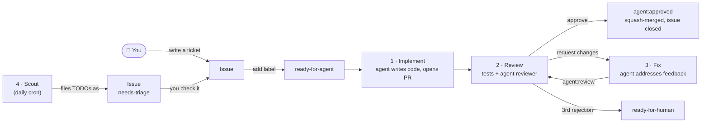

# The factory

This repo is a working example of the idea in [this post by Matt Pocock](https://x.com/mattpocockuk): use GitHub Actions as a cheap, ready-made software factory. Issues are tickets, labels move work between stages, and a coding agent runs on throwaway Actions runners to do the work.

The agent is [pi](https://github.com/earendil-works/pi) running `openai/gpt-6-luna` at `max` thinking through OpenRouter. Claude Code is also supported: see [Choosing the agent](#choosing-the-agent).

## How it maps to the post

| The post says | Where it is here |
|---|---|
| 1. Free sandboxes for public repos | Every agent runs on a fresh `ubuntu-latest` runner with no permission prompts. The runner is the sandbox, and it's thrown away afterwards. |
| 2. You already have a login | Permissions are GitHub's own: only people with triage access can add labels, so only they can start the factory. |
| 3. Tickets as issues | The implementer's prompt is [`.github/prompts/implement.md`](.github/prompts/implement.md) plus the issue title and body. |
| 4. Labels trigger actions, which create PRs | Adding `ready-for-agent` runs [`1-implement.yml`](.github/workflows/1-implement.yml), which opens a PR. |
| 5. Actions apply labels, which create loops | Review → fix → review, in [`2-review.yml`](.github/workflows/2-review.yml) and [`3-fix.yml`](.github/workflows/3-fix.yml). There's a round limit so it can't loop forever. |
| 6. Cron jobs for daily work | [`4-scout.yml`](.github/workflows/4-scout.yml) files `TODO(factory):` comments as tickets and posts a queue report. |
| 7. Simple observability | Each agent run streams a readable log, writes its model, turns and cost to the job summary, and uploads its full transcript as an artifact. Each issue and PR gets a comment linking to its run. |

## Labels

The first five are the default triage labels used by [Matt Pocock's skills](https://github.com/mattpocock/skills), such as `/triage` (see [`docs/agents/triage-labels.md`](docs/agents/triage-labels.md)). The `agent:*` labels show where a ticket is in the factory.

| Label | On | Meaning | Set by |
|---|---|---|---|
| `needs-triage` | issue | Someone needs to check this ticket. | scout, or anyone filing an issue |
| `needs-info` | issue | Waiting on the reporter for more information. | you, or `/triage` |
| `ready-for-agent` | issue | Go. Starts **1 · Implement**. | you, or `/triage` |
| `ready-for-human` | issue or PR | A human has to do this one. The factory adds it to a PR after the reviewer's third rejection. | you, `/triage`, or the factory |
| `wontfix` | issue | Won't be done. | you, or `/triage` |
| `agent:working` | issue | The implementer is on it. | factory |
| `agent:review` | PR | Starts **2 · Review**. | factory, or you to re-review |
| `agent:changes-requested` | PR | Starts **3 · Fix**. | factory, or you, with a comment saying what to change |
| `agent:approved` | PR | The reviewer approved and the factory merged it. | factory |
| `agent:failed` | either | A stage crashed. The comment links to the run. | factory |

## The catch: `GITHUB_TOKEN` doesn't trigger workflows

Events caused by the built-in `GITHUB_TOKEN` [don't start new workflow runs](https://docs.github.com/en/actions/security-for-github-actions/security-guides/automatic-token-authentication#using-the-github_token-in-a-workflow), apart from `workflow_dispatch` and `repository_dispatch`. This stops accidental infinite loops, but it also means a label the factory adds won't trigger the next stage.

So the labels here are the **state**, and each stage also runs `gh workflow run <next-stage>.yml` to start the next one. A label added by a human still triggers its stage, because that event comes from a real user.

If you'd rather have labels alone drive everything, use a GitHub App token or a fine-grained PAT instead of `GITHUB_TOKEN`. Events caused by those do trigger workflows.

## Guardrails

- **Cost**: each agent run has a cap: $1.50 to implement, $0.75 to review, $1.00 to fix. pi has no budget flag, so [`pi.mjs`](.github/actions/run-agent/pi.mjs) watches the cost pi reports and stops it once a run goes over. Claude Code enforces the cap itself with `--max-budget-usd`.
- **A spend limit on the key**: the per-run cap is counted on the runner. Give the OpenRouter key its own credit limit too, so OpenRouter refuses requests once the limit is reached, whatever happens on the runner.
- **Loops**: the reviewer can send a PR back twice. The third rejection hands it to a human.
- **Credentials**: the checkout uses `persist-credentials: false`, and `GH_TOKEN` is only set on the steps that need it. The agent gets the model key and nothing else. The workflow, not the agent, commits and pushes.
- **The reviewer is read-only**: its only tools are read, glob and grep. pi has no permission system, so this allowlist is the only thing stopping it from writing.
- **The reviewer must answer properly**: its verdict has to match a JSON schema. Claude Code enforces this with `--json-schema`. pi has no equivalent, so `pi.mjs` asks for a JSON block and checks it. A missing or malformed verdict fails the stage instead of being guessed.
- **No project-local agent config**: pi runs with `--no-approve`, so a PR can't add `.pi/extensions` that run inside the agent.
- **Script injection**: issue text reaches the agent through files and environment variables, never through `${{ }}` in shell scripts.
- **Concurrency**: one run per issue or PR at a time.
- **Prompt injection**: anyone can open an issue on a public repo, but only you can add `ready-for-agent`. Read a ticket before you label it.

## Setup

1. Create an OpenRouter API key just for this repo. Give it a credit limit and, if you like, a guardrail that allows only `openai/gpt-6-luna`. Add it as the `OPENROUTER_API_KEY` repository secret.
2. Settings → Actions → General: tick **Allow GitHub Actions to create and approve pull requests**.
3. Create the labels above.
4. Open an issue and add `ready-for-agent`.

## Choosing the agent

[`run-agent`](.github/actions/run-agent/action.yml) runs either harness:

| `harness` | Default `model` | Secret |
|---|---|---|
| `pi` (default) | `openrouter/openai/gpt-6-luna:max` | `OPENROUTER_API_KEY` |
| `claude` | `sonnet` | `CLAUDE_CODE_OAUTH_TOKEN` from `claude setup-token`, or `ANTHROPIC_API_KEY` |

To switch, change the `harness` default in `action.yml`. Or set `harness` and `model` on one stage's `run-agent` step, for example to review with a stronger model. pi takes any model it lists with `pi --list-models`, written as `provider/id:thinking`.

Don't use a ChatGPT or Codex subscription login here. OpenAI's [CI auth guide](https://developers.openai.com/codex/auth/ci-cd-auth) says not to use one on public repos. The login would also sit in a file the agent can read.
